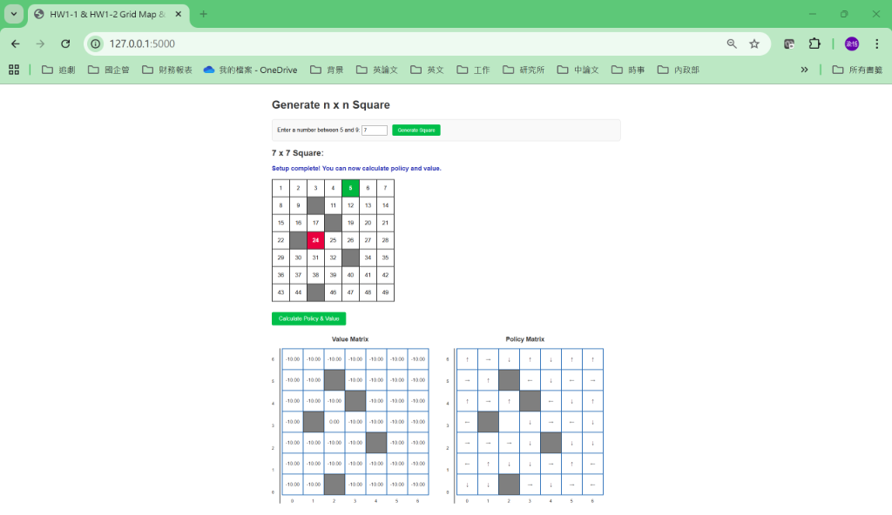

# 深度學習 作業二 (HW2) - 網格地圖與策略評估

這是一個基於 Flask 與強化學習 (Reinforcement Learning) 的 網格地圖 (Gridworld) 應用程式。使用者可以自訂地圖大小、起點、終點以及障礙物，並觀察在此環境下的隨機策略產生之「價值矩陣 (Value Matrix)」與「策略矩陣 (Policy Matrix)」。

## 系統需求
- Python 3.7+
- pip (Python 套件管理工具)

## 安裝與執行步驟

1. **安裝相依套件**
   請在專案目錄下開啟終端機 (Terminal / PowerShell)，輸入以下指令安裝所需的 Flask 與跨域套件：
   ```bash
   pip install flask flask-cors
   ```

2. **啟動後端伺服器**
   在同一個目錄下執行主程式：
   ```bash
   python app.py
   ```
   看到類似 `* Running on http://127.0.0.1:5000` 的提示即代表伺服器啟動成功。

3. **開啟網頁介面**
   請打開您的瀏覽器 (推薦使用 Chrome 或 Edge)，放進以下網址進入系統：
   ```text
   http://127.0.0.1:5000
   ```

## 系統操作說明

1. **設定網格大小**：在畫面頂端輸入 5 到 9 之間的數字，並點擊「Generate Square」。
2. **放置起點與終點**：
   - 第一次點擊：放置綠色「起點」(Start)。
   - 第二次點擊：放置紅色「終點」(End)。
3. **放置障礙物**：
   - 繼續點選其他空白格子可設定 $n-2$ 個灰色「障礙物」(Obstacles)。
4. **計算策略與價值**：
   - 設定完成後，點擊下方出現的「Calculate Policy & Value」按鈕。
   - 系統將會透過 Iterative Policy Evaluation 演算法計算結果，並在畫面最下方渲染出精美的 **Value Matrix** (包含小數點後兩位的數值) 與 **Policy Matrix** (包含上下左右的隨機策略箭頭)。

## 操作介面展示

